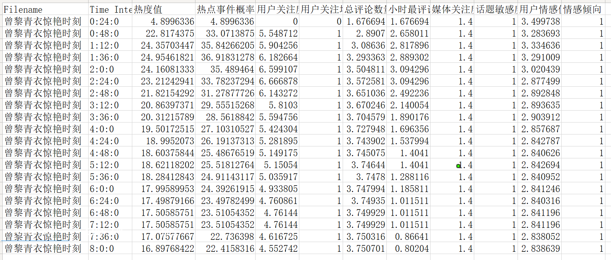

# 热点信息条目热度分析

# 一、实现方案

参考调研时论文中提到的热度值判别热点事件的方法。在本方法中计划设计一套热度值计算公式，用以计算每项事件的热度水平，随后对其热度进行排序，判断热点事件的最低热度水平。

## 1、 所需参数

**用户参与度U（user)：**用户参与度是评判广泛大众关注话题强弱程度的有效量化标准。而对于热点事件，尤其是负面热点事件，用户更愿意通过评论来表达自己的态度，而不是通过点赞来表达关注。因此收集话题出现后，话题下新闻评论的增长速度可以很好的说明用户的参与情况，若评论在短时间内大量增长，说明新闻广受用户关注，可能成为热点事件。另一方面，事件如成为热点，则其在出现阶段受关注程度会快速增长。因此用户参与度j可以从两方面进行评判，收集数据时会收集话题发布后的评论数据，从中获取两种数据指标：某一时间段内，评论数最多的一个时间段的评论数总量`dc`；总是间断内评论总数`c`。
在前期准备工作中，会通过数据分析产出两个函数，分别为`参与度/时段最多评论数函数`和`参与度/总评论数对应函数`，从而得到参与度水平$U_{dc}$和$U_{c}$，最终计算出用户参与度:
$$
U= a_{sum}*(\alpha U_{dc}+ \beta U_c\ \ \ \ \ (\alpha+\beta=1))
$$
对应方法采用公式进行转换：
$$
U_{dc}=\left\{
\begin{aligned}\log_{10}(dc)/t^2 & &U_{dc}>0
\\0&&U_{dc}<=0\end{aligned}
\right.\\
U_{c}=log_{10}(c)+1
$$

公式解释：该部分公式主要用来减小较大数量级参数对整体热度值计算的影响，使用对数函数可以更好的将其数量级压缩到较小范围，随后可以根据α和β进行调整。采用结果减固定值可以更好的筛选热点事件，如果事件热度很低则计算用户参与度可能产生负值，在后续热度值计算时产生更好的区分度。在`参与度/时段最多评论数对应表`计算过程中，如果某一时段产生了高峰，那么在该时段之后这一指标也会保持在较高水平，影响计算结果，因此要对其进行衰减，计算产生最多时段到最后一时段之间的距离，对最大值除以距离的平方实现衰减效果。

此外添加评论数增长加速度计算公式，通过加速度来预测评论数量增长趋势，从而反馈用户参与度。考虑到单纯计算出加速度难以进行量化处理，统一标准较难。因此计算两小时间段之间评论总数差额作为加速度，随后使用加速度除以前一时段评论总数得到加速度比。若加速度比达到阈值说明用户评论正在飞速增长。考虑到热点事件爆发速度快，短时间内（2~3小时）就可能快速发酵，因此不用过多比对加速度之间的联系，选择增加对较大加速度的关注程度即可。在每一时间节点，计算最后一个时段的增长率。采用公式：
$$
a={U_{dc_{n}}-U_{dc_{n-1}}}\\
a_{sum}=1+\left\{
\begin{aligned}log_{10}({a}) & &a_i>1
\\0\end{aligned}
\right.
$$

> 最新进展：

**媒体关注度/新闻数量 N(news)：**由于新闻热点事件有所区别，部分时政类事件可能评论量较低，但存在大量新闻进行报道，因此需要单独评估新闻数量对热点事件的影响。网络事件的热度等级越高，事件相关新闻数越多。需要注意的是，这里的新闻数量是指话题下重要新闻讨论的数量，而不是所有动态条目的数量。因此在搜集总新闻数量时，要进行简单判断。这里判断条件有两条，满足其一即可：1. 新闻发布者关注量达到100以上（待调整）。2. 该新闻评论量达到100以上（待调整）。对此根据以上条件统计新闻数量，并使用和上表类似的量化标准，将新闻数量量化为
$$
N=1+\frac {n}{100}
$$
公式解释：总新闻数量本身不会有过大的数量级，较小的新闻总数区别可能就存在是否容易成为热点的区别，因此该数据较为敏感，可以直接采用除法将其量化到较小的媒体关注度得分。

> 最新进展：

 **话题敏感度S：**不同类别的话题成为热点的概率也各不相同，有些话题内容的性质本身就更容易成为热点，因此关注话题敏感度也是热点发觉的一大关键因素。参考论文《多源数据融合的热点舆情事件分析技术研究与实现_朴炳旭》搭建针对群体 、管理 、领导 、学生 、伤病 、政治 、宗教七类事件的舆情知识库（L)，知识库中存储了每类时间的人物、地点、事件、三大词库。通过比对话题中主语、宾语与知识库中对应词库的重合度，若重合度大于50%则认定该话题属于某一类事件，并为其话题敏感度赋值

若匹配到多个敏感词库，则进行一定比例压缩，若匹配到类别数`n`个，则对求和结果乘以`（1-0.1n)`

| 默认 | 伤病 | 政治 | 宗教 | 群体 | 领导 | 学生 | 管理 |
| ---- | ---- | ---- | ---- | ---- | ---- | ---- | ---- |
| 1    | 4.5  | 4    | 3.5  | 3    | 2.5  | 2    | 1.5  |

> 最新进展：

**用户情感值F：**情感值用于评判在固定时间内（话题发布后5小时），话题下用户讨论的情感得分，在用户的评分当中，会有一些词语存在明显的情感倾向，汇总用户整体的情感趋势，可以笼统概括出用户群体对话题的态度表态，如果表态越激烈就约容易引起共情，引发热点话题。参考《多源数据融合的热点舆情事件分析技术研究与实现 朴炳旭》引入情感词 $F_{sen} $ 程度副词  $F_{Degree}$ 。情感词用于表达情感评价，程度副词用于表达感情强弱。使用大连理工大学整理标注的中文情感词典本题库来标注情感得分，计算每条评论情感值。此外考虑到评论中会有很多应援词也表达了一定感情但并不强烈，例如“同意”、“+1”等等，考虑到这些因素，也要为这些看似无感情词设置一定的情感得分，在数据分析过程中计算这类无情感值评论中数量$F_n$，最后将其按照平均情感值大小加权进总情感值当中。
$$
F=\frac{\sum_1^n{F_{sen}*F_{Degree}}}{n}*\frac{n+F_n}{n}
$$

> 最新进展：

## 2、 具体函数

时间热度值定义为t

$$
t=(U+N)*F*S
$$
在本公式中中综合考虑了媒体端和用户群体对事件成为热点事件的影响因素，并且综合考虑了事件本事的性质因素（话题敏感度）和事件社会反响强烈程度所导致成为热点可能性的程度。

由于目前还未经过数据集测试，各项参数占比还有待调整，可能存在部分值占比过大，影响评价标准平衡性的问题。


# 二、目前实现

## 1. 参数设置

```
time_subsection = 20  # 时间间隔数
time_sum = 0.4  # 每个间隔的时间长度
comment_data_location = r'data\test\comment_sum\\'  # 话题路径
title = '曾黎青衣惊艳时刻'  # 话题名称
```

目前程序需要更改所要检测的`话题名称`，并且可以根据所需设置检测的时间区间间隔。由于目前数据集是静态数据集，因此还要设置检测多少个时间间隔。

## 2. 输入信息

输入信息在读取时读取的是已有数据库中的单个话题，话题以excel文档形式存储。需要读取的信息有两部分：1）一个完整话题文件夹，文件夹内每条新闻的评论内容分别用一个表格存储。2）一个excel表格，其中包含话题下所有新闻的评论信息，汇总到一个表格内。

## 3. 输出信息

输出该事件每个时间节点的热度值、热点事件概率到表格中，通知保存热度值、热点事件概率图像。

输出数据结果



输出函数图像结果


# 三、 程序使用

## 1. 环境配置

程序运行环境需要python3.8以上，pytorch2.2.0以上。
其他所需软件包：

```
tqdm>=4.64.1
joblib>=1.0.0
requests>=2.25.1
numpy>=1.19.5
torch>=2.0.0
transformers>=4.39.2
pandas~=2.0.3
openpyxl~=3.1.2
cemotion~=2.1.1
setuptools~=69.2.0
```

## 2. 代码运行

现有程序已经封装在了`demo.py`当中，可以直接运行使用。

程序中用到了以下超参数和参数：

```
###超参数（可自定义修改
time_subsection = 10  # 时间间隔数
time_sum = 1  # 每个间隔的时间长度
title = '单亲妈妈网恋遇假军官被骗15万'  # 话题名称

###参数（最好不修改）
hotspots_boundary = 10  # 热度概率计算调整值（上线60）
log_total = 10  # 总评论数计算公式log值
log_maxH = 10  # 最多小时评论数计算公式log值
par_U_dc = 1  # 总评论数参数
par_U_c = 1  # 最多小时评论数参数
par_N = 5  # 媒体关注度除法分母参数（不能为零）

```

其中超参数可以根据所要检测的话题和时间尺度进行修改，参数为调试过程中较为合适的比例参数，已经较为合适不用修改。

在演示demo中会将计算结果保存到表格并输出图像。


# 最新更改

1. 修改话题敏感度匹配多敏感词库求平均值的问题，改为按比例压缩。

2. 修改了时间分段的超参数，现有热度计算值不在跟切分时间间隔直接相关，有专门参数`time_sum`管理计算使用间隔长度
3. 修正观众热度值增长率计算公式，避免基数较大情况下增长率不增反减情况。
